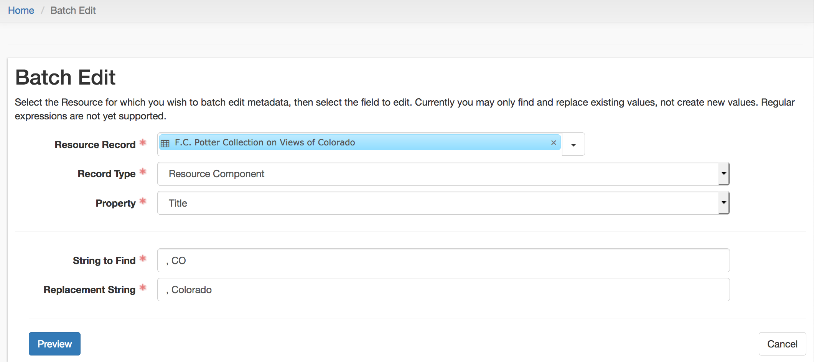

# Batch Edit

This plugin will allow for batch editing of records within a Resource. It expands upon the existing find/replace Background Job in two ways:

* Allows a user to preview the changes that the job will make before those changes are committed to the database
* Allows a user to select the records to which they wish to commit changes (rather than changing all records matching the specified conditions)

# Instructions for Use

First, select the Resource for which you wish to commit changes. The plugin will ask for the record type, and then the property within that record type, you want to edit. Last, specify the string within that property you want to find, and the string you want to replace it with:

The plugin will then search against the selected Resource for the values you provided in the main menu. The preview screen will display a table with all the records that the plugin will change, providing the option to select or de-select the records you want to edit:

# Disclaimer

Batch Edit doesn't do any of these things right now; it is currently an interface proof of concept for what it could do and how it might look.

Comments and pull requests are welcome. Questions can be directed to Kevin Clair, Metadata and Digitization Librarian at the University of Denver: kevin.clair at du.edu. 
